# ArcGIS API for JavaScript: 2D Visualization

length: 60 min

presenters: Kristian Ekenes, Jeremy Bartley

~~Mar. 11, 2020 2:30 p.m. - 3:30 p.m.~~ Prerecorded and presented on YouTube.

Palm Springs Convention Center, Catalina/Madera

## Summary

The ArcGIS API for JavaScript lets you build powerful interactive mapping applications. Learn how you can turn your raw data into information that tells a story with simple 2D data-driven visualizations. This session will provide an overview to the various visualization techniques available in the API specific to 2D vector data.

## Presentation

[Watch](https://www.youtube.com/watch?v=IJMhAXil9i4) the video presentation.

## Slides

[Click here to download slides](https://github.com/ekenes/conferences/raw/master/ds-2020/presentations/2d-viz/slides.pptx)

## Demos

### Visual Variables - Political Leanings

The following series of apps displays the same data multiple ways using visual variables.

[County Outlines](https://ekenes.github.io/conferences/ds-2020/2d-viz/demos/1-political/1-counties.html)

This app renders outlines with no data values.

[Total count with color](https://ekenes.github.io/conferences/ds-2020/2d-viz/demos/1-political/2-color-total.html)

Please don't do this. :)

[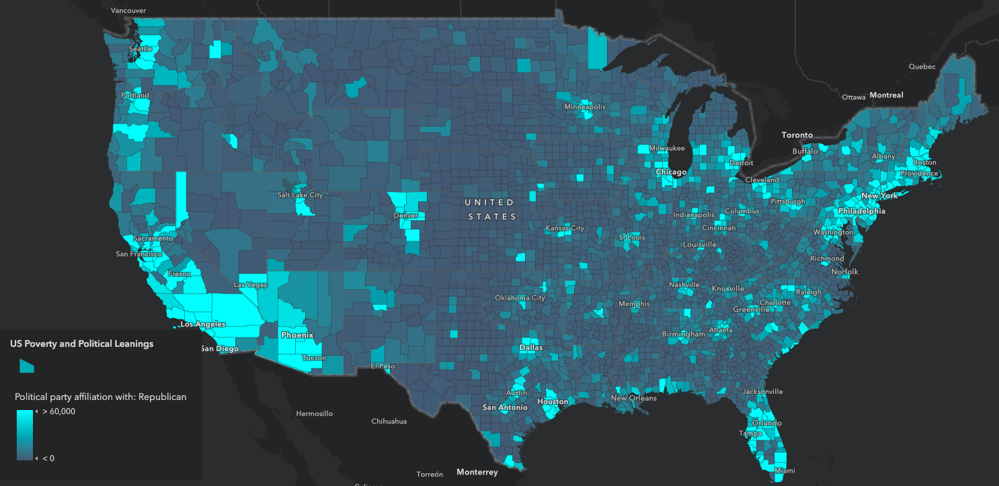](https://ekenes.github.io/conferences/ds-2020/2d-viz/demos/1-political/2-color-total.html)

[Normalized high to low](https://ekenes.github.io/conferences/ds-2020/2d-viz/demos/1-political/3-color-normalized.html.html)

This displays normalized data along a continuous color ramp. Much better.

[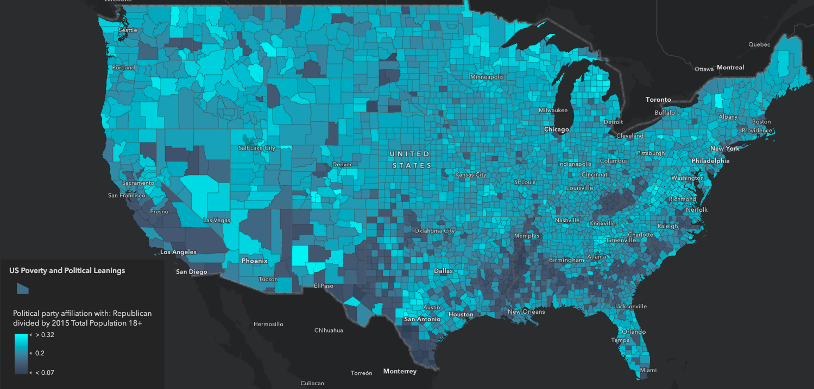](https://ekenes.github.io/conferences/ds-2020/2d-viz/demos/1-political/3-color-normalized.html.html)

[Normalized above and below](https://ekenes.github.io/conferences/ds-2020/2d-viz/demos/1-political/4-color-normalized-arcade.html)

This displays normalized data along a continuous diverging color ramp. This uses an Arcade expression to make the data values true percentages. The legend is much improved and easier to understand.

[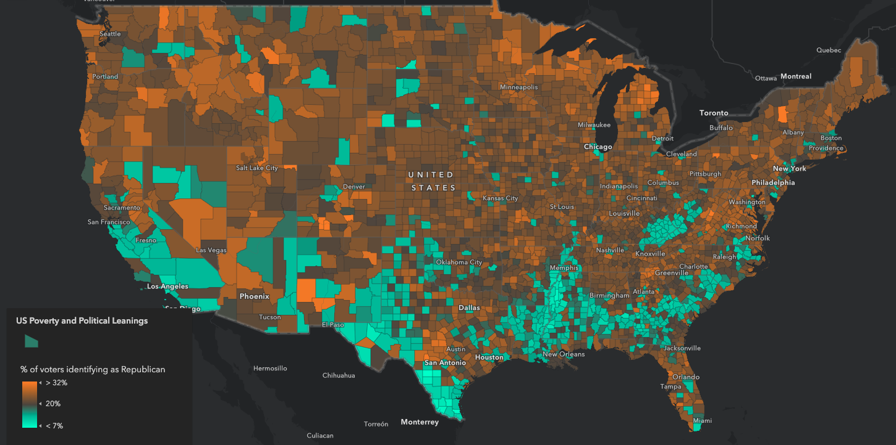](https://ekenes.github.io/conferences/ds-2020/2d-viz/demos/1-political/4-color-normalized-arcade.html)

[Predominance - color only](https://ekenes.github.io/conferences/ds-2020/2d-viz/demos/1-political/5-predominance-color.html)

This visual shows how you can add create a simple predominance renderer using Arcade to show which of all competing numeric categories has the hightest value. Does the county have more Democrats, Republicans, or Independents?

[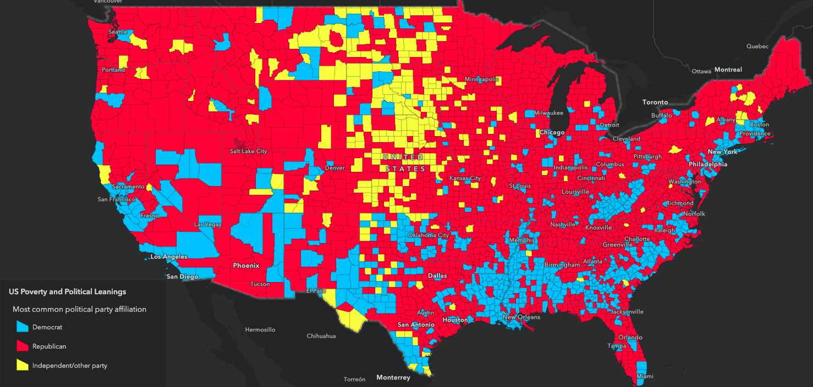](https://ekenes.github.io/conferences/ds-2020/2d-viz/demos/1-political/5-predominance-color.html)

[Predominance with opacity](https://ekenes.github.io/conferences/ds-2020/2d-viz/demos/1-political/6-predominance-color-opacity.html)

This map shows the same predominance renderer with an opacity visual variable to indicate the strength of the predominant value for each feature. The higher the opacity, the stronger the dominant value.

[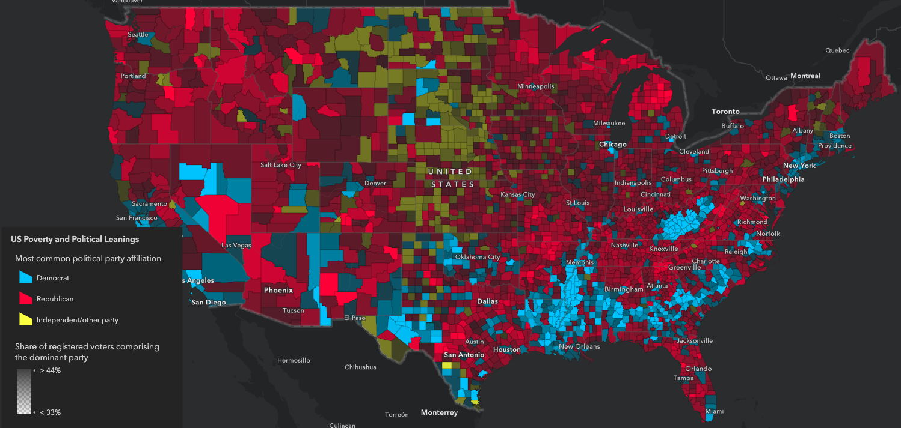](https://ekenes.github.io/conferences/ds-2020/2d-viz/demos/1-political/6-predominance-color-opacity.html)

[Predominance with opacity and size](https://ekenes.github.io/conferences/ds-2020/2d-viz/demos/1-political/7-predominance-color-opacity-size.html)

This map adds a size variable to show the total count of the categories for each polygon. This removes the area problem introduced by choropleth maps and gives a better indication of which patterns really matter.

[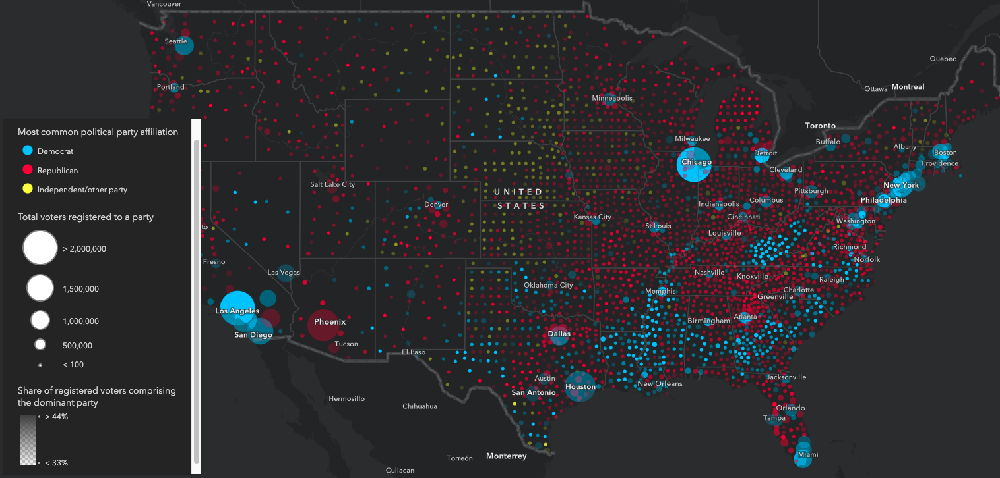](https://ekenes.github.io/conferences/ds-2020/2d-viz/demos/1-political/7-predominance-color-opacity-size.html)

[Webmap comparing totals of Republicans vs. Democrats vs. Independents](https://jsapi.maps.arcgis.com/apps/mapviewer/index.html?webmap=b0df9d7363cf4695808b57eb0a7dd9a5)

[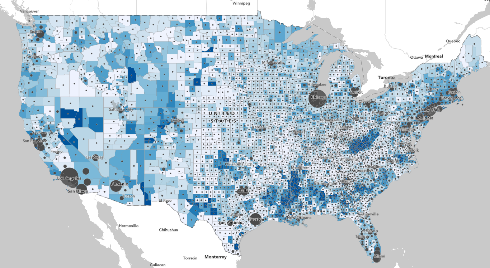](https://jsapi.maps.arcgis.com/apps/mapviewer/index.html?webmap=b0df9d7363cf4695808b57eb0a7dd9a5)

### Smart Mapping

[Smart mapping for data exploration](https://developers.arcgis.com/javascript/latest/sample-code/visualization-histogram-color/index.html)

This sample demonstrates how to create a data exploration app using the Smart Mapping APIs. You can use the slider widgets to modify the visualization based on variables set by the developer.

[Scale-dependent icons](https://codepen.io/kekenes/pen/JjoVWpz)

This sample demonstrates how to add a size variable for changing icon sizes by scale. Generally, icons should be larger as you zoom in and smaller as you zoom out. Read the accompanying blog [How and why to adjust symbol size by scale in web maps](https://www.esri.com/arcgis-blog/products/js-api-arcgis/mapping/how-and-why-to-adjust-size-by-scale-in-web-maps/) for more details.

[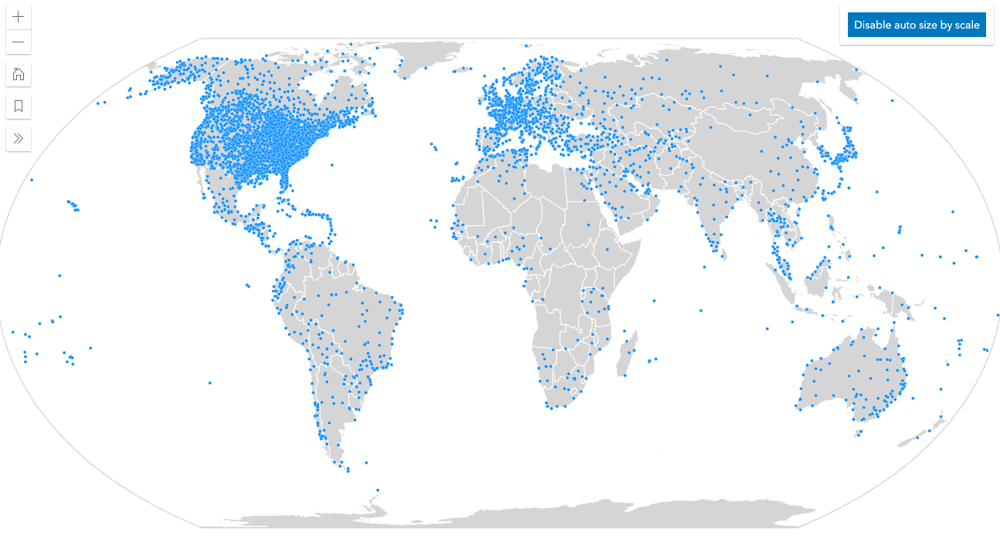](https://codepen.io/kekenes/pen/JjoVWpz)

[Scale-dependent outlines](https://codepen.io/kekenes/full/yLyrMGj)

This sample demonstrates how to add a size variable for changing outline sizes by scale. Generally, outlines should be thicker as you zoom in and thinner as you zoom out. Read the accompanying blog [How and why to adjust symbol size by scale in web maps](https://www.esri.com/arcgis-blog/products/js-api-arcgis/mapping/how-and-why-to-adjust-size-by-scale-in-web-maps/) for more details.

[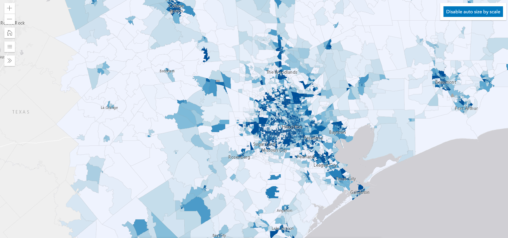](https://codepen.io/kekenes/full/yLyrMGj)

[Smart Mapping Sliders](https://ekenes.github.io/conferences/ds-2020/2d-viz/demos/5-sm-sliders/)

This sample displays all the sliders available in the JS API available for exploring your data and changing the visualization of your layers.

[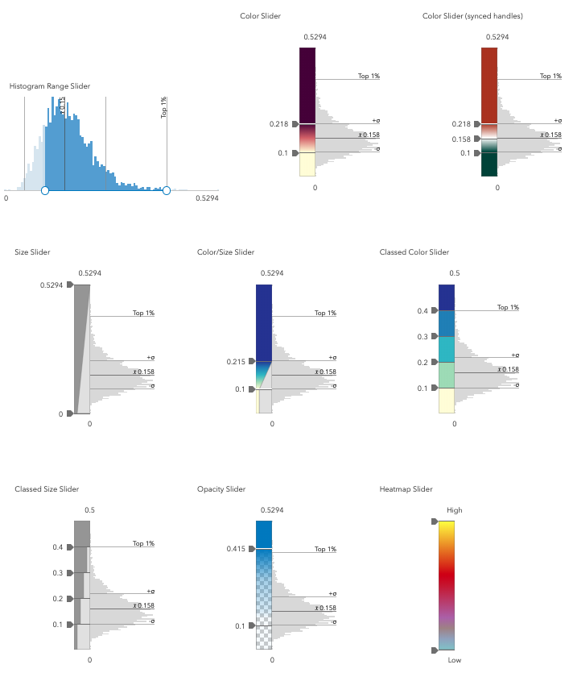](https://ekenes.github.io/conferences/ds-2020/2d-viz/demos/5-sm-sliders/))

### Clustering

[Basic point clustering](https://developers.arcgis.com/javascript/latest/sample-code/featurereduction-cluster/index.html)

[Cluster weather stations](https://developers.arcgis.com/javascript/latest/sample-code/featurereduction-cluster-visualvariables/index.html)

[Filter clusters](https://developers.arcgis.com/javascript/latest/sample-code/featurereduction-cluster-filter/index.html)

[Filter clusters with a slider](https://developers.arcgis.com/javascript/latest/sample-code/featurereduction-cluster-filter-slider/index.html)

[Clustering - 311 calls in NYC](https://ekenes.github.io/conferences/ds-2019/2d-viz/demos/smart-mapping/)

### Dot Density

[Dot Density - Population](https://ekenes.github.io/conferences/ds-2019/plenary/dot-density-legend)

[Dot Density - Housing growth animation](https://ekenes.github.io/conferences/ds-2019/plenary/dot-density-housing)

[Dot Density Explorer](https://ekenes.github.io/esri-ts-samples/visualization/dot-density/)

[Predominance Explorer](https://ekenes.github.io/esri-ts-samples/visualization/smart-mapping/predominance/boise-housing/)

### Fast updates

[Update renderer attribute](https://developers.arcgis.com/javascript/latest/sample-code/visualization-update-data/index.html)

[Colored histogram on ColorSlider](https://developers.arcgis.com/javascript/latest/sample-code/visualization-histogram-color/index.html)

### WebStyleSymbol

[WebStyleSymbol (2D)](https://developers.arcgis.com/javascript/latest/sample-code/webstylesymbol-2d/index.html)

[WebStyleSymbol proportionally sized](https://developers.arcgis.com/javascript/latest/sample-code/webstylesymbol-proportional-2d/index.html)

### CIM Symbols

[Wurman dots](https://developers.arcgis.com/javascript/latest/sample-code/cim-primitive-overrides/index.html)

[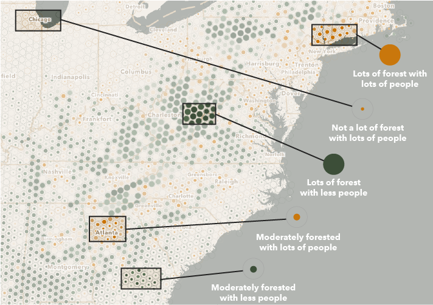](https://developers.arcgis.com/javascript/latest/sample-code/cim-primitive-overrides/index.html)

## Resources

* [Community](https://developers.arcgis.com/en/javascript/jshelp/community.html)
* [ArcGIS for JavaScript API Resource Center](http://help.arcgis.com/en/webapi/javascript/arcgis/index.html)
* [ArcGIS Blog](https://www.esri.com/arcgis-blog/author/kekenes/)
* [Twitter @kekenes](http://twitter.com/kekenes)

## Issues

Find a bug or want to request a new feature?  Please let us know by submitting an issue.

## Contributing

Esri welcomes contributions from anyone and everyone. Please see our [guidelines for contributing](https://github.com/esri/contributing).

## Licensing

Copyright 2020 Esri

Licensed under the Apache License, Version 2.0 (the "License");
you may not use this file except in compliance with the License.
You may obtain a copy of the License at

   http://www.apache.org/licenses/LICENSE-2.0

Unless required by applicable law or agreed to in writing, software
distributed under the License is distributed on an "AS IS" BASIS,
WITHOUT WARRANTIES OR CONDITIONS OF ANY KIND, either express or implied.
See the License for the specific language governing permissions and
limitations under the License.

A copy of the license is available in the repository's [license.txt](license.txt) file.