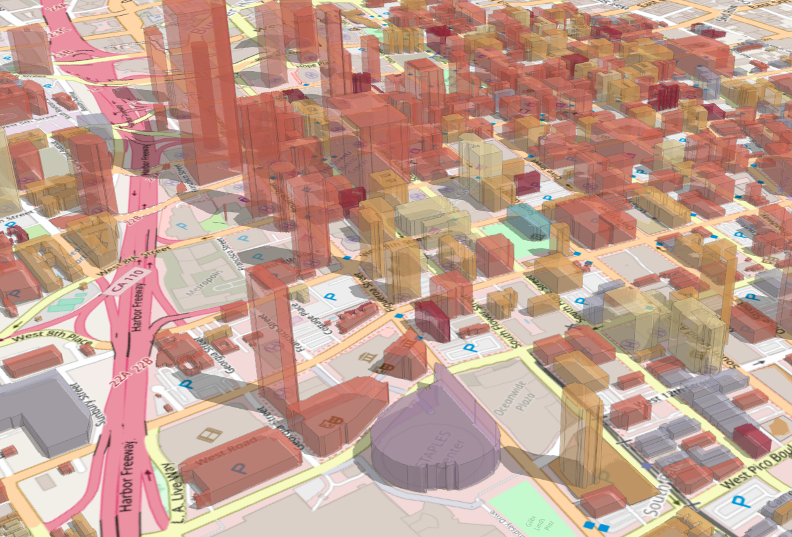
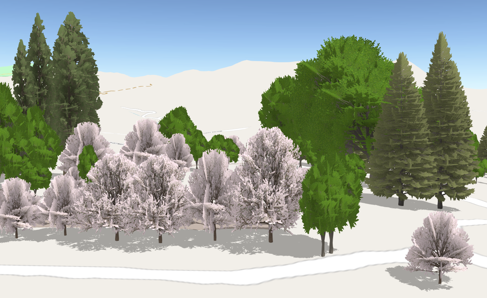

# Practical Guide for Building a 3D Web App From 2D Data

length: 60 min

presenters: Kristian Ekenes, Raluca Nicola

Mar. 11, 2020 5:30 p.m. - 6:30 p.m.

Palm Springs Convention Center, Primrose A

## Summary

Have you hesitated to build 3D apps because they look complicated or you lack the necessary data? In this session, learn how to build a 3D app using your 2D data and the resources provided out of the box by Esri and the ArcGIS API for JavaScript. Even if your data doesn't contain Z-values, you can build sophisticated 3D apps that leverage modern browser technology to render your 2D features with 3D symbology.

## Outline

- Building extrusion
- 3D models
- Z values from attributes

## Demos

### [Basic Extrusion](https://ekenes.github.io/conferences/ds-2020/3d-viz-2d-data/demos/extrusion/index.html)

This app demonstrates how to extrude a single polygon with a hard-coded value. It also uses a slider to demonstrate how the extrusion appears with various values.

### [Building Extrusion](https://ekenes.github.io/conferences/ds-2020/3d-viz-2d-data/demos/buildings/index.html)

This app builds on the previous one, but demonstrates how to extrude all polygons in a layer dynamically based on a `height` attribute field.

### [Trees](https://ekenes.github.io/conferences/ds-2020/3d-viz-2d-data/demos/trees/2-models.html)

Visualizes trees with their real world sizes using a 3D model provided out-of-the-box in the ArcGIS API for JavaScript. The underlying data is a 2D point FeatureLayer with attributes for height, width, and tree species.

